Выполнил: Симбирева Анастасия Андреевна
Вариант: 21
Сложность: Повышенная


Веб-приложение для управления рестораном: заказы, столы, меню, бронирование, зарплата персонала, аналитика. Реализована ролевая модель: официант, повар, администратор.
Проект создан с использованием генерации кода через ИИ (Deepseek, GPT-4, Claude.ai) в рамках выполнения 4 учебных заданий повышенной сложности.

Технологии
Backend: FastAPI, SQLAlchemy, Jinja2, SQLite

Аутентификация: JWT (httpOnly cookie), bcrypt

Тестирование: pytest, pytest-cov, httpx, in-memory SQLite

Контейнеризация: Docker, docker-compose

CI/CD: GitHub Actions (автоматический комментарий в PR через локальную модель Ollama + линтеры)

Логирование: стандартный logging

Структура проекта

```
text
lr_12/
├── .github/workflows/      # CI/CD (AI review workflow)
├── alembic/                # миграции БД
├── app/
│   ├── core/               # конфигурация, безопасность, БД
│   ├── models/             # SQLAlchemy модели
│   ├── repositories/       # слой доступа к данным
│   ├── routers/pages/      # роутеры для HTML-страниц (auth, menu, orders, kitchen, admin...)
│   ├── services/           # бизнес-логика
│   ├── static/             # CSS
│   ├── templates/          # Jinja2 шаблоны
│   ├── tests/              # unit-тесты и фикстуры
│   └── utils/              # вспомогательные функции
├── data/                   # монтируемая папка для SQLite (Docker)
├── docker-compose.yml
├── Dockerfile
├── requirements.txt
├── .env.example
├── alembic.ini
└── README.md
```
Запуск
1. Локально (без Docker)
bash
# Клонировать репозиторий
git clone <repo-url>
cd lr_12

# Создать виртуальное окружение
python -m venv venv
source venv/bin/activate   # Linux/Mac
venv\Scripts\activate      # Windows

# Установить зависимости
pip install -r requirements.txt

# Создать файл .env из примера (обязательно указать SECRET_KEY)
cp .env.example .env

# Применить миграции (если есть)
alembic upgrade head

# Запустить приложение
uvicorn app.main:app --reload
Приложение будет доступно по адресу http://localhost:8000.

2. Через Docker
bash
docker-compose up --build
База данных сохраняется в папке ./data на хосте.
Остановка: docker-compose down

Переменные окружения (файл .env)
Переменная	Описание	Пример
SECRET_KEY	Секретный ключ для JWT	your-secret-key
ALGORITHM	Алгоритм JWT	HS256
ACCESS_TOKEN_EXPIRE_MINUTES	Время жизни токена (мин)	60
DATABASE_URL	URL подключения к БД	sqlite:///./data/restaurant.db
ADMIN_USERNAME	Логин администратора	admin
ADMIN_PASSWORD	Пароль администратора	change-me
BOOKING_DURATION_MINUTES	Длительность брони (мин)	120
COOKIE_SECURE	Флаг secure для cookie (true для HTTPS)	false
# Тестирование
Запуск тестов с измерением покрытия:
```
bash
pytest app/tests/ -v --cov=app --cov-report=term --cov-report=html
Итоговое покрытие кода (после исправления всех тестов) – >90%.
```
Запуск тестов в Docker

Для запуска тестов внутри контейнера выполните:

```bash
docker-compose build
docker-compose run --rm restaurant_app pytest app/tests/ -v --cov=app --cov-report=term
```
# Тесты покрывают:
(Примечание отчет не добавлен в репозиторий)
все сервисы (auth, order, menu, table, user, work_log, table_booking, analytics)

граничные случаи (пустые заказы, отрицательные цены, занятые столы, пересечение броней)

обработку ошибок HTTP 400/401/403/404

валидацию Pydantic

Покрытие после отладки тестов: ~92% (отчёт coverage.py).

Роли и функционал
Официант (waiter) – просмотр меню и столов, создание заказов, изменение статуса своих заказов (new/paid), учёт отработанных часов, просмотр своей зарплаты.

Повар (cook) – страница кухни (активные заказы), изменение статусов (new → cooking → ready), просмотр истории заказов, доступ к рецептам.

Администратор (admin) – всё выше + управление пользователями (смена ролей, удаление), управление меню и столами, аналитика, зарплаты всех сотрудников, удаление любых заказов.

# Скриншоты

Скриншот выполнения тестов:
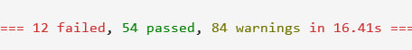
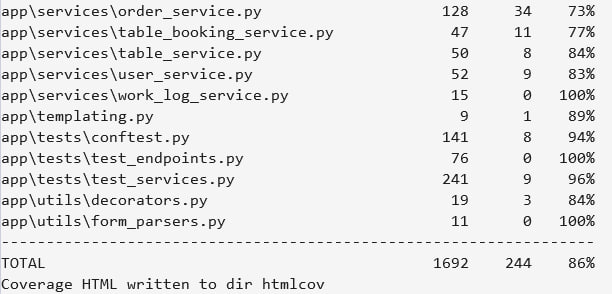
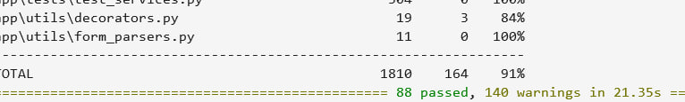
Скриншоты основных экранов приложения:
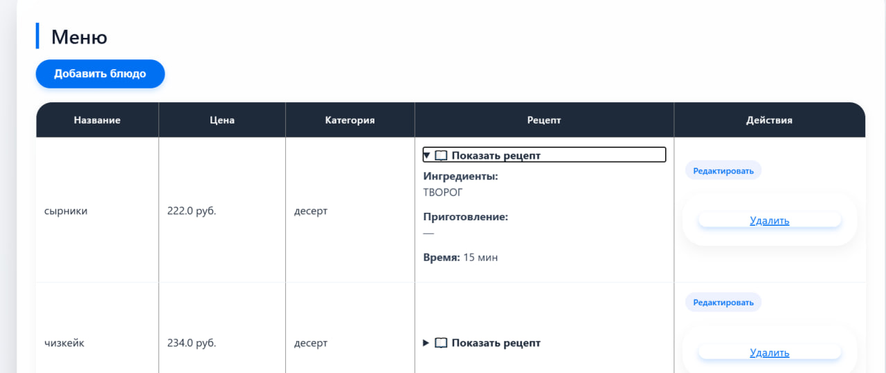
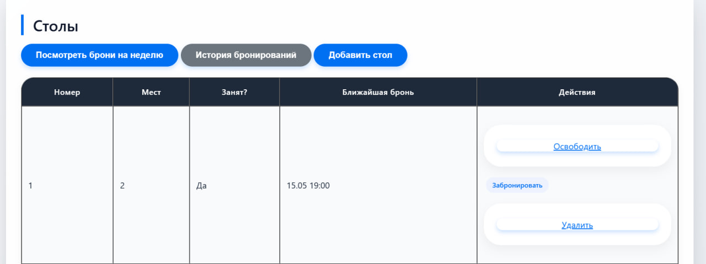
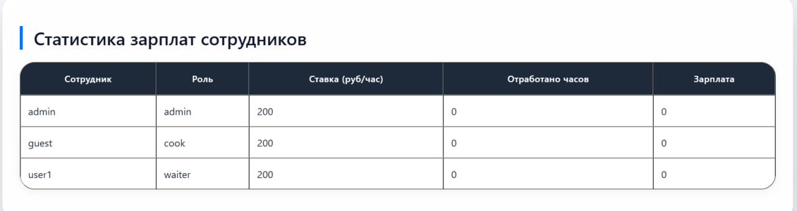
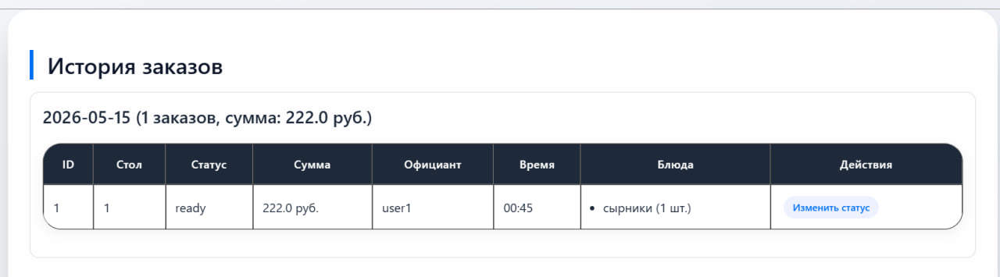
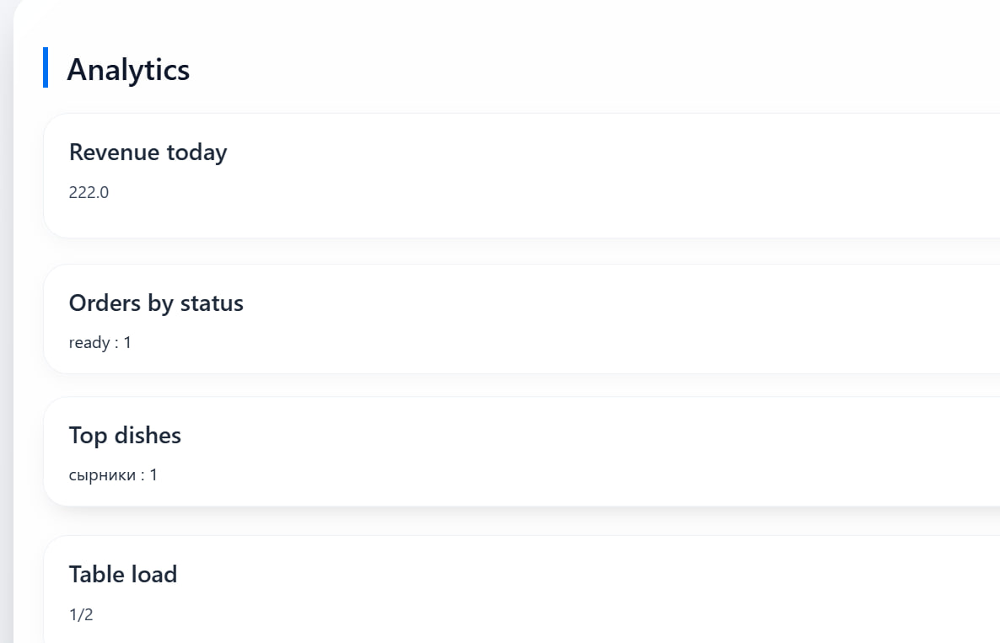
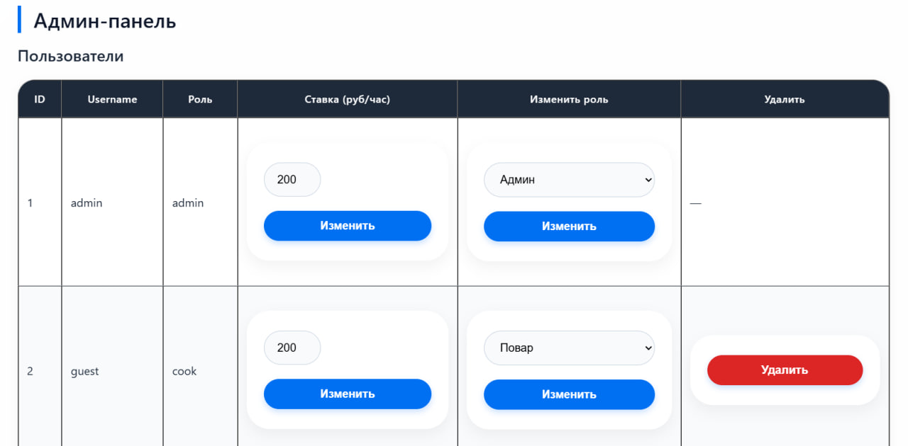
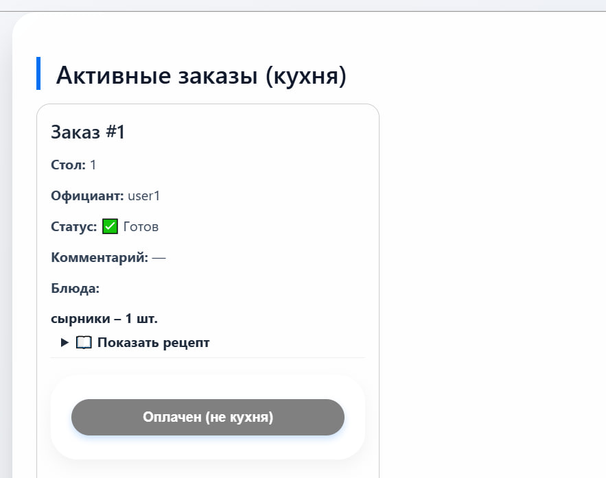
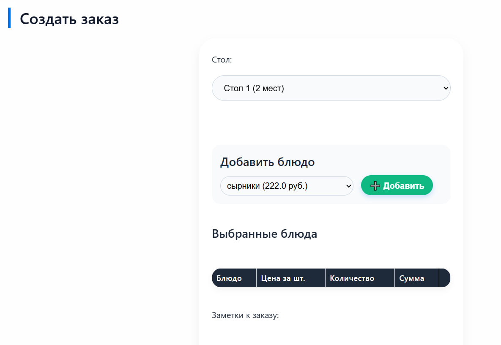
